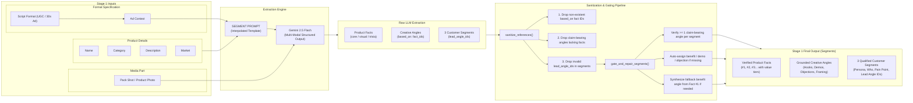

# Stage 1 Pipeline Architecture

This document describes the multi-modal extraction, grounding, and sanitization flow for Stage 1 of the Script Assistant pipeline.

## Pipeline Diagram

```mermaid
flowchart LR
    %% Inputs Subgraph
    subgraph Inputs ["Stage 1 Inputs"]
        direction TB
        subgraph ProdDetails ["Product Details"]
            P1["Name"]
            P2["Category"]
            P3["Description"]
            P4["Market"]
        end

        subgraph Media ["Media Part"]
            Img["Pack Shot / Product Photo"]
        end

        subgraph Format ["Format Specification"]
            Fmt["Script Format (UGC / 30s Ad)"]
            Fmt --> AdCtx["Ad Context"]
        end
    end

    %% Prompt & Model Subgraph
    subgraph Engine ["Extraction Engine"]
        direction TB
        Prompt["SEGMENT PROMPT<br/>(Interpolated Template)"]
        Model["Gemini 2.5 Flash<br/>(Multi-Modal Structured Output)"]
    end

    %% Raw Output Subgraph
    subgraph RawOut ["Raw LLM Extraction"]
        direction TB
        RF["Product Facts<br/>(core / visual / trivia)"]
        RA["Creative Angles<br/>(based_on: fact_ids)"]
        RS["3 Customer Segments<br/>(lead_angle_ids)"]
    end

    %% Sanitization & Gating Pipeline
    subgraph Guardrails ["Sanitization & Gating Pipeline"]
        direction TB
        Sanitize["sanitize_references()"]
        S1["1. Drop non-existent based_on fact IDs"]
        S2["2. Drop claim-bearing angles lacking facts"]
        S3["3. Drop invalid lead_angle_ids in segments"]
        Sanitize --> S1 & S2 & S3

        Gate["gate_and_repair_segments()"]
        G1["Verify >= 1 claim-bearing angle per segment"]
        G2["Auto-assign benefit / demo / objection if missing"]
        G3["Synthesize fallback benefit angle from Fact #1 if needed"]
        Gate --> G1 & G2 & G3

        S3 --> Gate
    end

    %% Final Stage 1 Output
    subgraph Stage1Output ["Stage 1 Final Output (Segments)"]
        direction TB
        OF["Verified Product Facts<br/>(#1, #2, #3... with value tiers)"]
        OA["Grounded Creative Angles<br/>(Hooks, Demos, Objections, Framing)"]
        OS["3 Qualified Customer Segments<br/>(Persona, Who, Pain Point, Lead Angle IDs)"]
    end

    %% Connections
    ProdDetails --> Prompt
    AdCtx --> Prompt
    Prompt --> Model
    Img --> Model

    Model --> RawOut
    RawOut --> Sanitize
    G1 & G2 & G3 --> Stage1Output
```
